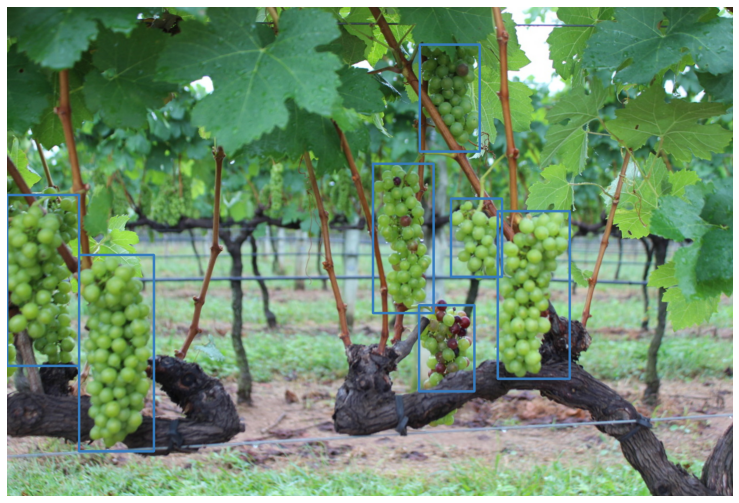

# Object Detection Pytorch

### The notebook is intended to be used with google colab.

The notebook shows how to train, custom object detection model in pytorch. The model is fasterrcnn with resnet50 backbone(backbone pertrained on imagenet). map@0.3:0.1:0.9 is used as evaluation metric. [Wgisd](https://github.com/thsant/wgisd) dataset of grapes is used.

